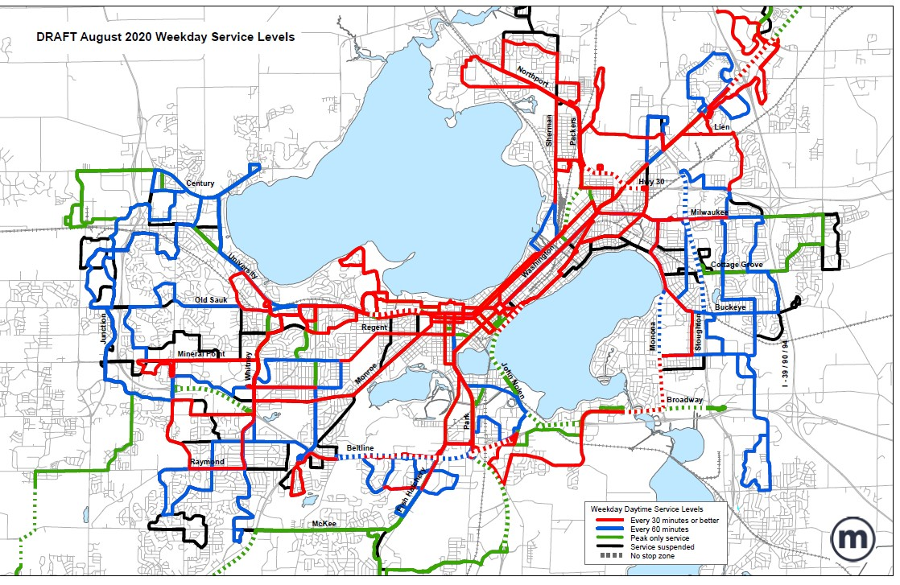
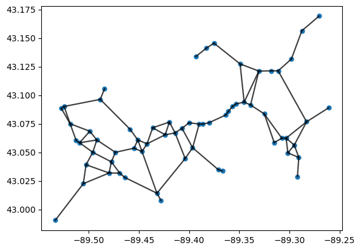

# Madison Metro Transit Optimization

Optimization techniques are a brilliant way of modelling various real-life scenarios and play with their behavior in an attempt to improve their working in the real world. In this project, we use a linear program to model the bus transit system of the city of Madison in Wisconsin with goals of minimizing the average travel time of passengers while also minimizing the fuel consumption costs for the Madison Metro Bus Transit authorities.

Madison Metro Transit plans to redesign its bus system by August 2023. They're looking to increase access and bus frequency and decrease travel times to better meet the needs of Madison-area residents and businesses, while also being cost effective as per the proposed budget for the project.

It has also been seen that the ridership has slowly declined for the last six years, with an even greater impact seen in the last couple of years due to COVID-19. We believe that a more efficient system will increase ridership and will allow Metro Transit to live up to its classification as a high-performing system, similar to bus systems in larger cities like Chicago and New York.

## Model

We model this problem using a **minimum-cost network flow problem** which is a very simple, linear formulation to optimize the bus transit routes.

$$\begin{align*}
\underset{x_i \in \mathbb{R^n}}{\text{minimize}}\qquad& c^\mathsf{T} \sum_i x_i \\
\text{subject to:}
\qquad& \forall i, Ax_i = b_i
\end{align*}$$

Where:  
$A$ is the Incidence matrix of the fully connected network of intersections  
$x_i$ is the flow that satisfies the $i^\text{th}$ pair of conencted stops  
$b_i$ is the required movement between the $i^\text{th}$ pair of conencted stops  
$c_j$ is the vector costs of movement between all pairs of nodes  
$\sum_i x_i$ is the total flow of the network (i.e. the combination of all $i$ unique types of flow)

## Respository Structure

This repository has the following directories:
- `./images`: Contains the images used for the project report as well as output images generated
- `./data`: Contains the datasets downloaded from the [City of Madison Data Hub](https://data-cityofmadison.opendata.arcgis.com/)

The main linear minimum-cost network flow model used by us is in `model.ipynb`, and it is used by `ProjectReport.ipynb` which is also our final deliverable for the project containing the final report.

## Results

Here are some sample results:

which we further superimposed on the Map of Madison (GoogleMaps API):

